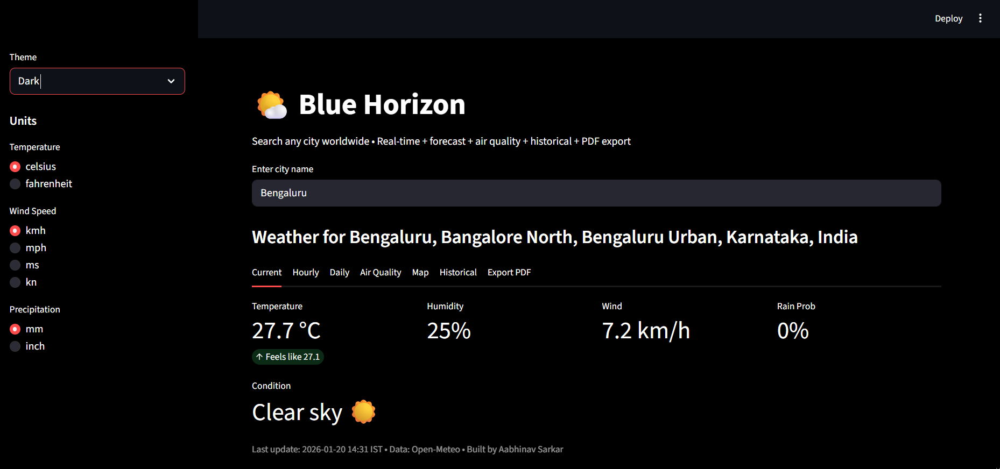

# Hey, I'm Aabhinav! :)

I’m a **Marketing and Technology student** with a strong interest in how digital tools, data, and software can be used to improve everyday systems and business decision-making. I enjoy learning through hands-on experience and prefer building projects that help me understand both the technical and strategic side of digital products.

My focus is on developing a solid foundation in **Python, APIs, and application logic**, while continuously improving how I structure and organise my code. I’m particularly interested in automation, productivity tools, and data-driven solutions.

---

### What I’m currently working on

I’m actively building and refining personal projects to apply my learning in real-world scenarios.

- **Weather Forecasting App(Blue Horizon)** — using Python and real-time APIs to fetch and display weather data.
 
- **Todo List App** — a compact task management application focused on clean logic and simplicity.
  
-   Improving backend structure, readability, and project organisation.

---

### Skills & tools

- Python 
- APIs  
- GitHub & version control  
- VS Code  
- Basic data visualisation
- Java/Javascript
- CSS/HTML
- PHP
- C++
- C

---

### Let’s connect

- 🔗 **LinkedIn:** https://www.linkedin.com/in/aabhinav-sarkar-b7641b21a/

---

⭐ *Always learning. Always building. Always improving.*
